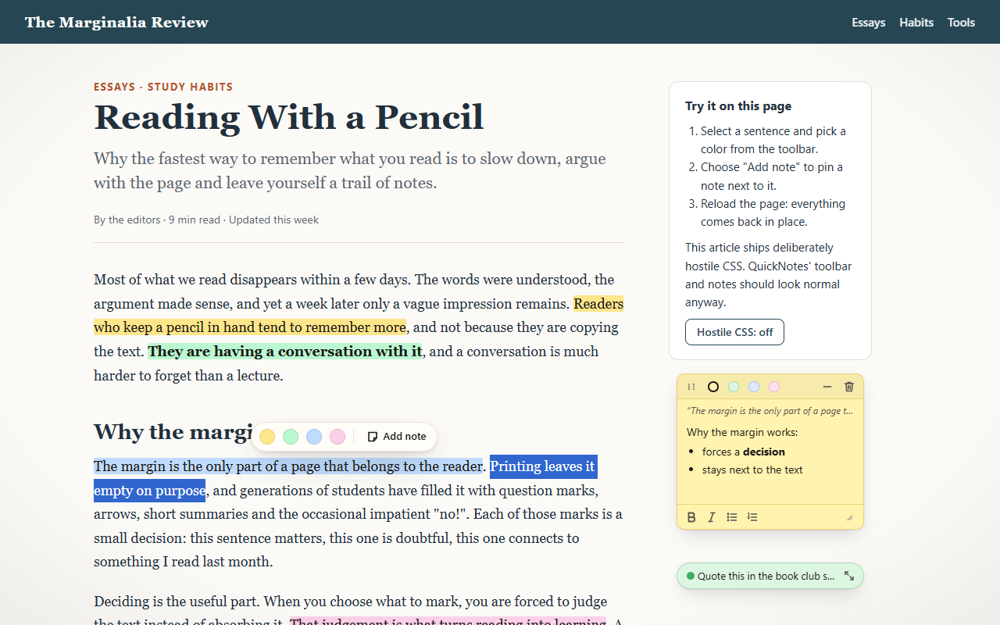
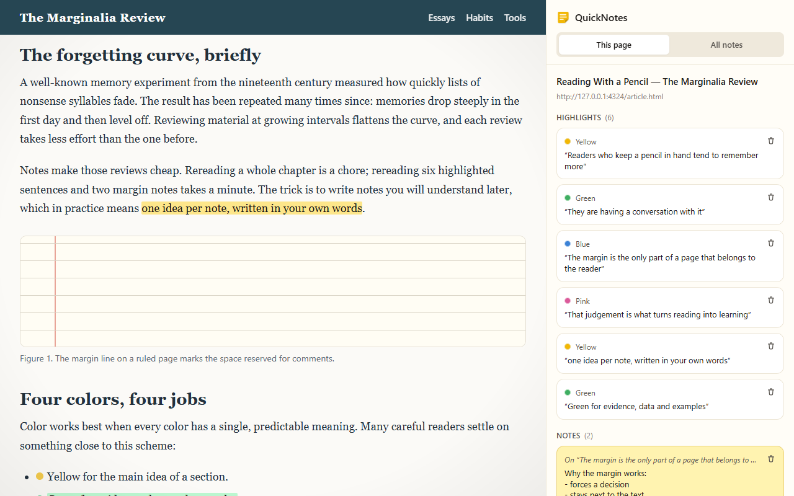
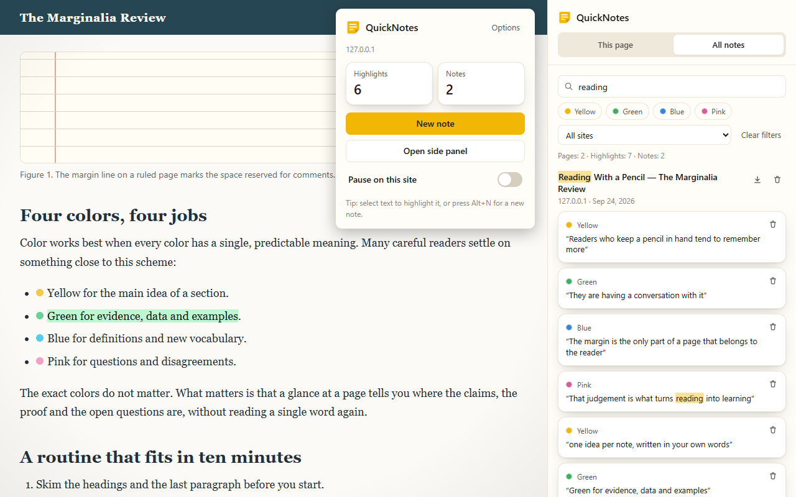

# QuickNotes — highlights and sticky notes for any web page

A Manifest V3 Chrome extension. Select text to highlight it in one of four pastel colors, pin
draggable sticky notes anywhere on a page, and find everything again when you come back — anchored
to the text, not to pixel positions. Search every note you have taken from the side panel and export
them to Markdown. Everything stays in your browser: no account, no network requests, no analytics.

Interface in English and Spanish (follows the browser language).



| The side panel: everything on this page                                                                               | "All notes": search, filters, and the popup                                                                                     |
| --------------------------------------------------------------------------------------------------------------------- | ------------------------------------------------------------------------------------------------------------------------------- |
|  |  |

## Features

- **Highlight** — a small toolbar appears over any text selection: yellow, green, blue, pink, or
  "Add note". Also available from the right-click menu ("Highlight with QuickNotes"). Click a
  highlight to recolor it, attach a note, or delete it.
- **Sticky notes** — draggable, resizable, minimizable, four paper colors, bold / italic / bulleted
  and numbered lists (<kbd>Ctrl</kbd>+<kbd>B</kbd>, <kbd>Ctrl</kbd>+<kbd>I</kbd>). Positions are
  stored as percentages of the page size. A note holds up to about 100,000 characters: typing or
  pasting past that is refused with a message, never silently cut.
- **Robust anchoring** — highlights come back after a reload even when the page changed around them;
  repeated phrases are told apart by their context; highlights whose text is gone are listed as
  _orphaned_ instead of being drawn in the wrong place.
- **Side panel** — "This page" lists the page's highlights, notes and orphaned highlights; click one
  to scroll to it and flash it. "All notes" lists every page with full-text search (case- and
  accent-insensitive), color and site filters, per-page delete and export.
- **Export / import** — Markdown or JSON for the current page or for everything (a normal file
  download); JSON import is validated and merges (see below).
- **Popup** — counts for the current page, New note, Open side panel, Pause on this site (turning
  it off also resumes a page paused through its parent domain). Files on your computer have no site
  to pause; when Chrome's "Allow access to file URLs" is off, the popup says how to turn it on.
- **Keyboard shortcut** — <kbd>Alt</kbd>+<kbd>N</kbd> adds a note to the current page (change it at
  `chrome://extensions/shortcuts`).
- **Options** — default color, show/hide the selection toolbar, shortcut info, paused sites, opt-in
  automatic restore on every site, light/dark/system theme, and delete-all behind a typed
  confirmation (`DELETE`).
- **Isolated UI** — everything QuickNotes draws lives in a closed Shadow DOM: the page's CSS cannot
  break it, its CSS cannot leak into the page, and the page's scripts cannot read or change your
  notes. The demo article proves it with deliberately hostile CSS.

## Permissions

| Permission                                     | Why                                                                                                         |
| ---------------------------------------------- | ----------------------------------------------------------------------------------------------------------- |
| `storage`                                      | Keep notes and highlights (`storage.local`) and settings (`storage.sync`).                                  |
| `activeTab`                                    | Run on the tab you act on — popup, context menu or shortcut — without access to any other site.             |
| `scripting`                                    | Inject the note/highlight script into that tab; register it for all sites only if you opt in.               |
| `contextMenus`                                 | The "Highlight with QuickNotes" item.                                                                       |
| `sidePanel`                                    | The side panel.                                                                                             |
| `http://*/*`, `https://*/*` (optional, opt-in) | Requested only when you enable "Restore my notes automatically on every site"; removed when you disable it. |

Without the opt-in, a page's notes reappear when you click the QuickNotes button on it. See
[PRIVACY.md](PRIVACY.md) for the privacy policy and [DECISIONS.md](DECISIONS.md) for the reasoning.

## Install (load unpacked)

Requirements: Node.js 22.22+ (developed with Node 24) and Chrome 116+.

```bash
npm ci
npm run build
```

Open `chrome://extensions`, enable **Developer mode**, click **Load unpacked** and choose the
`dist/` folder. Pin QuickNotes to the toolbar.

## Try it with the demo article

`demo/article.html` is a sample article (original text, fictional publication) whose global CSS is
deliberately hostile: `* { font-family: serif; color: #c00; box-sizing: content-box; letter-spacing:
2px }` with `!important`, restyled `div`, `button`, `mark`, `p` and lists, rules that hide
`[role=toolbar]` and `[contenteditable]`, and fixed overlays at the maximum z-index. QuickNotes' UI
must look normal on it anyway.

- **Over http (recommended):** `npm run demo`, then open <http://127.0.0.1:4323/article.html>
  (`PORT=4329 npm run demo` for another port). Click the QuickNotes button once, select a sentence
  and pick a color; add a note; reload the page and click the button again — everything comes back
  in place. With "Restore my notes automatically" enabled in Options, no click is needed.
- **As a local file:** open `demo/article.html` directly (`file:///…`). Chrome only lets extensions
  run on `file://` pages while **Allow access to file URLs** is on in the extension's details on
  `chrome://extensions` (Chrome turns it on for an unpacked extension; a Web Store install starts
  with it off, and the popup says so). A local file has no site, so it cannot be paused.
- Add `#calm` to the URL (or use the button in the article's sidebar) to switch the hostile CSS off;
  notes are shared by both modes because QuickNotes ignores the URL fragment.

## Development

| Command                | What it does                                                                                   |
| ---------------------- | ---------------------------------------------------------------------------------------------- |
| `npm run dev`          | Vite dev server (port 4320) writing a live-reloading build to `dist/`; load it unpacked.       |
| `npm run build`        | Type-checks (`tsc`, including tests and e2e) and builds the production extension into `dist/`. |
| `npm run lint`         | ESLint (flat config, type-aware).                                                              |
| `npm test`             | Vitest unit tests (jsdom).                                                                     |
| `npm run test:e2e`     | Builds, then runs the Playwright end-to-end suite against the unpacked extension.              |
| `npm run demo`         | Serves `demo/` on <http://127.0.0.1:4323>.                                                     |
| `npm run store-assets` | Builds, then captures the Chrome Web Store screenshots and promo tile into `store-assets/`.    |
| `npm run zip`          | Builds and packs `dist/` into `quicknotes-v1.0.0.zip` with `manifest.json` at the root.        |
| `npm run icons`        | Re-renders `public/icons/icon-{16,32,48,128}.png` from `public/icons/icon.svg`.                |
| `npm run format`       | Prettier.                                                                                      |

### Tests

**Unit tests** (`npm test`, Vitest + jsdom): URL normalization, storage (against an in-memory
`chrome.storage` mock), anchor serialization and resolution (text changed around a quote, repeated
quotes, whitespace, XPath fallback, orphans), highlight wrapping, the HTML sanitizer, Markdown
export, JSON import validation, full-text search and filters, the locale files, and the store
listing (character limits, image sizes, and 24-bit screenshots without alpha).

**End-to-end tests** (`npm run test:e2e`, `@playwright/test` 1.57.0) load the built `dist/` as an
unpacked extension and use `demo/article.html`. Playwright only reaches into _open_ shadow roots, so
most specs load a copy of `dist/` in which the content script's single `attachShadow({ mode:
"closed" })` call is patched to `"open"` (nothing else differs); the install and privacy specs load
`dist/` exactly as shipped.

- select text → the toolbar appears → highlight in each color; a note with bold text typed with
  <kbd>Ctrl</kbd>+<kbd>B</kbd>, dragged, resized and minimized; reload → highlights and the note
  reappear at the same coordinates (automatic restore opted in from Options);
- the default install: nothing runs until the toolbar button is clicked (a real `activeTab` grant),
  and after a reload the next click re-injects and restores; the popup's New note and Open side
  panel;
- computed styles inside the shadow root are unaffected by the hostile CSS, notes stay above the
  page's maximum-z-index overlays, and nothing leaks into the page;
- the real side panel (listing, click to scroll, delete, orphaned section, Markdown export content),
  "All notes" search, color and site filters, Markdown/JSON downloads, import round trip and
  validation errors;
- "Pause on this site" (no toolbar, no restore, badge) and resuming; every Options setting;
  revoking site access on `chrome://extensions` unregisters the automatic-restore script;
- the context menu's and Alt+N's real listeners (fired in the service worker with the events'
  `dispatch()`, because automation cannot open Chrome's menu or press a browser shortcut), the
  highlight menu, and a page whose text changed between visits;
- in the shipped build, the page's own scripts cannot reach a note (closed shadow root);
- SVG text and the page's own editors inside a highlighted range are left alone; the toolbar appears
  on pages that stop `mouseup` from bubbling and stays inside the window at both edges;
  <kbd>Ctrl</kbd>+<kbd>U</kbd> adds no underline; a 66,000-character paste is kept in full and a
  paste past the limit is refused;
- on a local file, the popup explains "Allow access to file URLs" and shows no pause switch;
- no errors in any extension context (Chrome's own extension error log, the pages, popup and side
  panel), no manifest warnings, and no network APIs in the build.

The harness (`e2e/harness.ts`) picks the browser with `QN_E2E_BROWSER`:

- `chromium` — Playwright's bundled Chromium with `--load-extension` (`QN_CHROMIUM_PATH` overrides
  the executable);
- `chrome` — the installed Google Chrome, which ignores `--load-extension` since version 137, so
  the extension is loaded through the DevTools method `Extensions.loadUnpacked`;
- `auto` (default) — Chromium, falling back to Chrome when it cannot start.

The `activeTab` spec clicks the toolbar button through `Extensions.triggerAction`, which only recent
Chrome offers, so it always runs in the installed Chrome, whatever `QN_E2E_BROWSER` says; it is
skipped only when `QN_E2E_BROWSER=chromium` limits the run to Chromium. `QN_E2E_HEADED=1` shows the
browser, `QN_E2E_PORT` changes the demo server port (default 4324).

## Package for the Chrome Web Store

```bash
npm run zip
```

produces `quicknotes-v1.0.0.zip` (the version comes from `package.json`) with `manifest.json`,
`_locales/` and `icons/` at the root of the archive. The listing text is in
[`store-assets/description.md`](store-assets/description.md), the privacy answers in
[`PRIVACY.md`](PRIVACY.md), and the step-by-step publishing guide (in Spanish) in
[`docs/PUBLISHING.md`](docs/PUBLISHING.md).

## How highlight anchoring works

When you highlight text, QuickNotes stores:

1. **the quote** — the exact text — with up to 32 characters of **context** before and after it;
2. **a fallback position** — the XPath of the element around each end of the selection, plus a
   character offset into that element's text;
3. the character position in the page text, used only to break ties.

When the page loads again, QuickNotes builds an index of the page's text and searches for the quote,
ignoring whitespace differences. If it appears once, that's it. If it appears several times, the
occurrence whose surroundings best match the saved context wins. If the quote is gone, the XPath
fallback is tried, and its text is accepted only if it is still at least 75 % similar to the quote
(so a changed capital letter or a fixed typo keeps the highlight, a rewritten sentence does not).
Anything else is reported as orphaned and listed in the side panel. Pages that render late
(single-page apps) are watched for a few seconds before a highlight is declared orphaned.

Highlights are drawn by wrapping the matching text in `<quicknotes-mark>` elements with inline
`!important` styles; notes, toolbars and menus live in a single, closed Shadow DOM host. Text inside
SVG or MathML and inside the page's own editors (`contenteditable`) is left out of the index and
never wrapped: a mark there would make a chart label disappear, or end up in what the site saves.
Known limitation: highlighting part of a text run that is a direct child of a flex or grid
container splits it into separate layout items, so the container's `gap` shows around the mark.

## Import and merge strategy

JSON import (side panel → All notes → Import JSON) is all-or-nothing: the whole file is validated
first and every problem is reported with its path (for example
`pages[0].highlights[0].color: expected one of yellow, green, blue, pink`); nothing is written unless
it is all valid. A valid file is **merged** into what you have:

- pages that exist only in the file are added (URLs are normalized again, note HTML is sanitized
  again);
- for a page on both sides, highlights and notes are matched by id and the copy with the newer
  `updatedAt` wins; items that exist on one side only are kept;
- nothing already stored is deleted, so importing the same backup twice changes nothing.

## Project structure

```
src/
  background/   service worker: context menu, Alt+N, injection, auto-restore registration, badge
  content/      index.ts (controller), anchor.ts, highlighter.ts, shadow.ts,
                toolbar.tsx, stickyNote.tsx, app.tsx, icons.tsx, content.css
  lib/          types, storage, url, markdown (export/import), search, richtext, sanitize,
                messages, i18n, colors, merge
  popup/  sidepanel/  options/  ui/  styles/
  _locales/en  _locales/es
tests/          Vitest unit tests
e2e/            Playwright end-to-end tests and harness
demo/           article.html — the demo page with hostile CSS
scripts/        zip.mjs, demo-server.mjs, icons.mjs, store-assets/ (screenshot capture)
store-assets/   listing text, screenshots, promo tile, store icon
docs/           PUBLISHING.md — Chrome Web Store publishing guide (Spanish)
public/icons/   icon.svg and the rendered PNGs
```

## Privacy

QuickNotes makes no network requests and contains no analytics. Notes, highlights and settings are
stored with the `chrome.storage` API in your browser profile; settings may follow your profile if
you use Chrome sync. Deleting the extension deletes its data. Full policy: [PRIVACY.md](PRIVACY.md).
